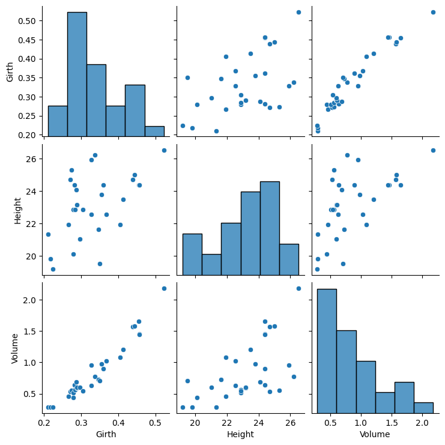

---
jupytext:
  formats: md:myst
  text_representation:
    extension: .md
    format_name: myst
    format_version: 0.13
    jupytext_version: 1.11.5
kernelspec:
  display_name: Python 3
  language: python
  name: python3
---

# Multiple Regression
Multiple regression is an extension of linear regression that involves more than one independent variable.
```{admonition} Independet and dependent
:class: tip

**Dependent variable**: The variable we are trying to explain with our model.  
**Independent variable(s)**: The variable(s) we use to explain the dependent variable.
```

There are many different ways and packages available to perform multiple regression in Python. Some methods involve doing it manually, others use the sklearn package, and some rely on Statsmodels. Today, we will focus on using Statsmodels.

In this example, we will use a dataset called *trees* from the `datasets` package. The *trees* dataset contains measurements of the girth, height, and volume of 31 felled black cherry trees.

First, we need to import the necessary packages.
```{code-cell}
import pandas as pd
import statsmodels.api as sm
import statsmodels.formula.api as smf
import seaborn as sns
import numpy as np
import matplotlib.pyplot as plt

```
Next, we will import the `trees` dataset and convert the measurements from inches, feet, and cubic feet to meters and square meters. After that, we’ll take a first look at the dataset by viewing the first few rows with the `head`-method.
```{code-cell}

trees = sm.datasets.get_rdataset('trees').data

df = trees
df['Girth'] = df['Girth'] * 0.0254
df['Height'] = df['Height'] * 0.3048
df['Volume'] = df['Volume'] * 0.0283168
df =df.round(3)
df.head()
```
<div>
<style scoped>
    .dataframe tbody tr th:only-of-type {
        vertical-align: middle;
    }

    .dataframe tbody tr th {
        vertical-align: top;
    }

    .dataframe thead th {
        text-align: right;
    }
</style>
<table border="1" class="dataframe">
  <thead>
    <tr style="text-align: right;">
      <th></th>
      <th>Girth</th>
      <th>Height</th>
      <th>Volume</th>
    </tr>
  </thead>
  <tbody>
    <tr>
      <th>0</th>
      <td>0.211</td>
      <td>21.336</td>
      <td>0.292</td>
    </tr>
    <tr>
      <th>1</th>
      <td>0.218</td>
      <td>19.812</td>
      <td>0.292</td>
    </tr>
    <tr>
      <th>2</th>
      <td>0.224</td>
      <td>19.202</td>
      <td>0.289</td>
    </tr>
    <tr>
      <th>3</th>
      <td>0.267</td>
      <td>21.946</td>
      <td>0.464</td>
    </tr>
    <tr>
      <th>4</th>
      <td>0.272</td>
      <td>24.689</td>
      <td>0.532</td>
    </tr>
  </tbody>
</table>
</div>
At this point, it’s useful to first visualize the data. This helps us decide which model might fit best (in this case, no surprise—it’s linear regression!).

To plot the data, we can use either the `seaborn` package, which offers more advanced plotting options, or `matplotlib`, which serves as a more basic, flexible sandbox for visualizations. I decided to use the `pairplot()`-method from seaborn for plotting scatterplot matrices, because it´s just one line of code.
```{code-cell}
sns.pairplot(df)
plt.show()
```


After the initial visual inspection, you might notice a clear linear relationship between *Volume* and *Girth*, and a slightly weaker one between *Volume* and *Height*. However, *Height* and *Girth* don't seem to have an obvious relationship.

**Our goal is to build a linear regression model with `Volume` as the dependent variable and `Height` and `Girth` as the independent variables.**

We'll use the `ols()` function from `Statsmodels`  to create the multiple linear regression model. The formula is written in an R-style format, which is convenient for those familiar with R. It's specified as `response ~ predictor(s)`, and since we have two independent variables, we combine them with a `+` sign. Finally, the `summary()` function will give us a detailed overview of the regression results.
```{admonition} Ordinary Least Squares (OLS) 
:class: tip

OLS is a method used to minimize the sum of squared differences between the observed values of the dependent variable (from the dataset) and the predicted values generated by a linear function based on the independent variables.
```
```{code-cell}
model = smf.ols(formula='Volume ~ Girth + Height', data=df).fit()
model.summary()
```
<table class="simpletable">
<caption>OLS Regression Results</caption>
<tr>
  <th>Dep. Variable:</th>         <td>Volume</td>      <th>  R-squared:         </th> <td>   0.948</td>
</tr>
<tr>
  <th>Model:</th>                   <td>OLS</td>       <th>  Adj. R-squared:    </th> <td>   0.944</td>
</tr>
<tr>
  <th>Method:</th>             <td>Least Squares</td>  <th>  F-statistic:       </th> <td>   253.5</td>
</tr>
<tr>
  <th>Date:</th>             <td>Thu, 12 Sep 2024</td> <th>  Prob (F-statistic):</th> <td>1.16e-18</td>
</tr>
<tr>
  <th>Time:</th>                 <td>15:41:57</td>     <th>  Log-Likelihood:    </th> <td>  25.957</td>
</tr>
<tr>
  <th>No. Observations:</th>      <td>    31</td>      <th>  AIC:               </th> <td>  -45.91</td>
</tr>
<tr>
  <th>Df Residuals:</th>          <td>    28</td>      <th>  BIC:               </th> <td>  -41.61</td>
</tr>
<tr>
  <th>Df Model:</th>              <td>     2</td>      <th>                     </th>     <td> </td>   
</tr>
<tr>
  <th>Covariance Type:</th>      <td>nonrobust</td>    <th>                     </th>     <td> </td>   
</tr>
</table>
<table class="simpletable">
<tr>
      <td></td>         <th>coef</th>     <th>std err</th>      <th>t</th>      <th>P>|t|</th>  <th>[0.025</th>    <th>0.975]</th>  
</tr>
<tr>
  <th>Intercept</th> <td>   -1.6417</td> <td>    0.245</td> <td>   -6.694</td> <td> 0.000</td> <td>   -2.144</td> <td>   -1.139</td>
</tr>
<tr>
  <th>Girth</th>     <td>    5.2528</td> <td>    0.296</td> <td>   17.763</td> <td> 0.000</td> <td>    4.647</td> <td>    5.859</td>
</tr>
<tr>
  <th>Height</th>    <td>    0.0314</td> <td>    0.012</td> <td>    2.593</td> <td> 0.015</td> <td>    0.007</td> <td>    0.056</td>
</tr>
</table>
<table class="simpletable">
<tr>
  <th>Omnibus:</th>       <td> 0.891</td> <th>  Durbin-Watson:     </th> <td>   1.258</td>
</tr>
<tr>
  <th>Prob(Omnibus):</th> <td> 0.640</td> <th>  Jarque-Bera (JB):  </th> <td>   0.926</td>
</tr>
<tr>
  <th>Skew:</th>          <td> 0.304</td> <th>  Prob(JB):          </th> <td>   0.629</td>
</tr>
<tr>
  <th>Kurtosis:</th>      <td> 2.410</td> <th>  Cond. No.          </th> <td>    359.</td>
</tr>
</table>

**What does the summary tell me?**
The regression summary provides key information about the model, starting with the basic *coefficients*:
* `Intercept` ($b_0$): The value of the dependent variable (Volume) when all independent variables (Girth and Height) are zero.
* `Girth`: The change in Volume when Girth increases by one unit, assuming Height remains constant.
* `Height`: The change in Volume when Height increases by one unit, assuming Girth remains constant.

Each coefficient also includes:

* *Standard error*: A measure of the accuracy of the coefficient estimate.
* *t-values*: A test statistic showing how many standard errors the coefficient is away from zero.
* *p-values*: A small p-value suggests that the relationship between the dependent variable and the corresponding independent variable is statistically significant.

**R-squared and Adjusted R-squared**

* *R-squared*: This is the squared Pearson correlation, which shows the proportion of the total variance explained by the regression model. However, R-squared tends to increase as more predictors are added, even if those predictors don’t improve the model meaningfully.
* *Adjusted R-squared*: This is a better measure because it adjusts for the number of predictors, applying a penalty for adding unnecessary independent variables. It’s more reliable for evaluating the model’s true explanatory power.

**F-statistic and its p-value**
* *F-statistic*: A large F-statistic indicates that the variation explained by the model (the "explained variation") is much greater than the unexplained variation. This suggests that the independent variables are useful for predicting the dependent variable.
* The F-statistic and its *p-value* are calculated by comparing the fitted regression model to a model with no predictors, using analysis of variance (ANOVA). Essentially, this tells us if adding predictors improves the fit of the model.
* A significant F-statistic (often evaluated at a significance level of 0.05) means that the independent variables have real predictive power. However, in cases with many parameters, adjustments for multiple tests may require a more conservative significance level.

Now, we want to predict the tree `volume`. We can easily do this using the `predict()`-method for the `ols()` object. To make predictions, we will provide different values for `Girth` and `Height`, which we'll store in a Pandas DataFrame called `X_predict`.
```{code-cell}
X_predict = pd.DataFrame({'Girth': [0.3, 0.4, 0.5], 
                   'Height': [20, 21, 22]})
prediction_new = model.get_prediction(X_predict)
prediction_new.predicted_mean
```
```{code-cell}
array([0.56306007, 1.11978645, 1.67651283])
```
The output shows us the mean predicted volumes for the different `Girths` and `Heights`.

**Congratulations!** You’ve successfully fitted your first linear model on a dataset!
