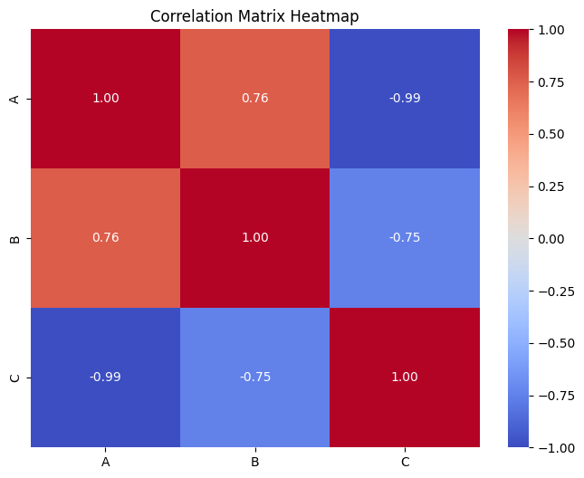

---
jupytext:
  formats: md:myst
  text_representation:
    extension: .md
    format_name: myst
    format_version: 0.13
    jupytext_version: 1.11.5
kernelspec:
  display_name: Python 3
  language: python
  name: python3
---

# Correaltion
  For correlation analysis, you have several packages to choose from, such as `NumPy`, `SciPy`, and `pandas`. In this course, we'll focus on the `pandas` package, as it is particularly convenient when working with `pandas` dataframes.
```{admonition} Pearson´s correlation
:class: tip

Pearsons´s correaltion coeffcient is computed as the ratio of the covariance and the product of the standard deviations `x` and `y`.
<br>$
r = \frac{\text{Cov}(X, Y)}{s_X s_Y}
$

``` 
After importing the package, we'll create our own `pandas` dataframe to work with.
```{code-cell}
import pandas as pd
x = pd.Series(range(10, 20))
x
```
| Column 1 | Column 2 |
|----------|----------|
| 0        | 10       |
| 1        | 11       |
| 2        | 12       |
| 3        | 13       |
| 4        | 14       |
| 5        | 15       |
| 6        | 16       |
| 7        | 17       |
| 8        | 18       |
| 9        | 19       |
```{code-cell}
y = pd.Series([2, 1, 4, 5, 8, 12, 18, 25, 96, 48])
y
```
| Index | Value |
|-------|-------|
| 0     | 2     |
| 1     | 1     |
| 2     | 4     |
| 3     | 5     |
| 4     | 8     |
| 5     | 12    |
| 6     | 18    |
| 7     | 25    |
| 8     | 96    |
| 9     | 48    |

 Now you can calculate the correlation between them by calling `.corr()` on one Series and passing the other Series as the argument:
 ```{code-cell}
 x.corr(y) 
 ```
 ```{code-cell}
0.7586402890911867
 ```
By default, the `.corr()` method uses Pearson correlation. However, you can also specify different methods for calculating correlation:

* pearson (default)
* spearman
* kendall
```{code-cell}
x.corr(y, method='spearman')  
```
```{code-cell}
0.9757575757575757
```
# Correation Matrices
when trying to compute more than one correlation between variables, it gets very messy without a better way of visualization. For that isntance one uses Correaltion matrices

First we make another pandas-dataframe, but this time with three variables, and we round the results to two decimal places of the correaltion

```{code-cell}
#implement data
data = {
    'A': [0, 1, 2, 3, 4, 5, 6, 7, 8, 9],
    'B': [2, 1, 4, 5, 8, 12, 18, 25, 96, 48],
    'C': [9, 7, 8, 6, 5, 4, 3, 2, 1, 0]
}
# Create a pandas Dataframe
df = pd.DataFrame(data)

# Compute the correlation matrix
corr_matrix = df.corr()

# Round the correlation matrix to 2 decimal places
corr_matrix_rounded = corr_matrix.round(decimals=2)

print(corr_matrix_rounded)
```
```{code-cell}
      A     B     C
A  1.00  0.76 -0.99
B  0.76  1.00 -0.75
C -0.99 -0.75  1.00
```
Now you have your very own correlation matrix.You can enhance the readability of your correlation matrix by converting it into a heatmap using the `seaborn` library's `sns.heatmap()` function. Here’s how you can do it:
Paramters explained:
* `annot=True`: Displays the correlation values inside the heatmap cells.
* `cmap='coolwarm'`: The color map for the heatmap, which you can adjust based on your preference.
* `center=0`: Centers the color map at 0.
* `vmin and vmax`: Define the limits of the color scale, which range from -1 to 1 for correlation coefficients.
* `fmt=".2f"`: Formats the annotation text to 2 decimal places.

```{code-cell}
plt.figure(figsize=(8, 6))
sns.heatmap(corr_matrix_rounded, annot=True, cmap='coolwarm', center=0, vmin=-1, vmax=1, fmt=".2f")

# Set title and labels
plt.title('Correlation Matrix Heatmap')
plt.show()
```

